# Warmhouse

# Задание 1. Анализ и планирование
## 1. Текущее решение
 - Нынешнее приложение компании позволяет только управлять отоплением в доме и проверять температуру.
 - Каждая установка сопровождается выездом специалиста по подключению системы отопления в доме к текущей версии системы.
 - Архитектура приложения представляет из себя монолит на Go с СУБД Postgres. Всё синхронно. Никаких асинхронных вызовов, микросервисов и реактивного взаимодействия в системе нет. Всё управление идёт от сервера к датчику. Данные о температуре также получаются через запрос от сервера к датчику.
 - Самостоятельно подключить свой датчик к системе пользователь не может.

### 1. Описание функциональности монолитного приложения

**Управление отоплением:**

- Пользователи могут управлять отоплением в доме
- Система поддерживает проверку температуры в доме
- Для подключения нового датчика требуется выезд специалиста

**Мониторинг температуры:**

- Система получает данные о температуре с датчиков, установленных в домах
- Пользователи могут просматривать текущую температуру в своих домах через веб-интерфейс 
- Система поддерживает только синхронные вызовы - для обновления данных о температуре пользователю необходимо сделать запрос

### 2. Анализ архитектуры монолитного приложения

Архитектура приложения представляет собой монолит на Go с СУБД Postgres. Всё синхронно. Никаких асинхронных вызовов, микросервисов и реактивного взаимодействия в системе нет. Всё управление идёт от сервера к датчику. Данные о температуре также получаются через запрос от сервера к датчику.

### 3. Определение доменов и границы контекстов

1. **Домен**: Управление устройствами (Device management)\
   **Контекст**:
   - Учёт зарегистрированных датчиков
   - Статусы устройств (в сети / не в сети / неисправен)
   - Привязка устройств к конкретным домам/пользователям
2. **Домен**: Управление сценариями и автоматизацией (Scenario and automation management)\
   **Контекст**:
   - Логика работы для отопления, освещения, ворот и других типов устройств.
   - Сценарии и автоматизация — визуальное или кодовое создание условий: "Если… то…", по времени, событиям, телеметрии и т.д.
   - Группировка устройств — по комнатам, зонам, категориям ("дом", "двор" и т.п.).
3. **Домен**: Доступ и наблюдение (Remote access and telemetry)\
   **Контекст**:
   - Мониторинг и наблюдение — поток данных от устройств (температура, движение, открытие, камера и т.д.)
   - Журнал событий — история действий пользователя, устройств, срабатываний сценариев
   - Удалённый доступ — интерфейс управления, удалённое открытие ворот, включение света и т.п.
4. **Домен**: Самообслуживание и персонализация (User self-service and SaaS)\
   **Контекст**:
   - Регистрация и настройка аккаунта — создание профиля, выбор тарифа, подключение дома
   - Магазин/каталог оборудования — выбор нужных датчиков: отопление, освещение, ворота и т.п.
   - Платёжный модуль — оплата подписки, поддержка тарифов, биллинг
   - Настройка дома — описание дома (комнаты, этажи), создание собственных зон
5. **Домен**: Инфраструктура датчиков и шина событий (Core and Messaging)\
   **Контекст**:
   - Сетевой уровень взаимодействия между устройствами и платформой — приём и маршрутизация сообщений от устройств
   - Хранилище телеметрии — хранение данных для анализа и отображения
   - Шина событий / Event Bus — для сценариев, уведомлений, автоматизации

    
### **4. Визуализация контекста системы**
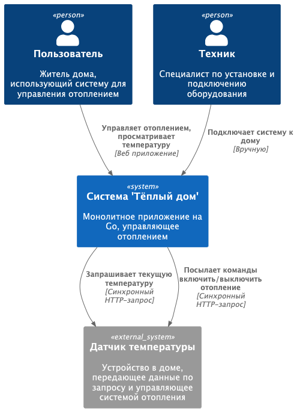

# Задание 2. Проектирование микросервисной архитектуры
## 1. Декомпозиция приложения на микросервисы.

#### 1. AuthService
Регистрация пользователей, учёт SaaS-подписок
#### 2. UserManagementService
Профили пользователей, настройка домов
#### 3. DeviceManagementService
Учёт устройств, отправка команд на устройства
#### 4. ScenarioService
Создание сценариев: "Если температура ниже X, включить отопление" или "При открытии ворот — включить свет"
#### 5. DeviceCommunicationService
Сервис взаимодействия между платформой и устройствами (передеча данных с датчиков, опрос датчиков)
#### 6. TelemetryService
Сбор и хранение телеметрии с устройств (температура, статус, события)
#### 7. HomeOnboardingService
Подключение дома: подключение устройств, настройка
#### 8. BillingService
Работа с платёжными системами (подписки, списания)
#### 9. APIGateway
Единая точка входа для клиентов (маршрутизацией трафика)

## 2. Определение взаимодействия.
### Взаимодействия между микросервисами
#### 1. Frontend -> APIGateway
Все пользовательские запросы идут через APIGateway
#### 2. APIGateway -> AuthService
Аутентификация, авторизация, получение токена
#### 3. APIGateway -> UserManagementService
Работа с профилями пользователей, настройкой домов
#### 4. APIGateway -> DeviceManagementService
Просмотр/регистрация устройств, управление устройствами
#### 5. APIGateway -> HomeOnboardingService
Добавление и настройка дома
#### 6. APIGateway -> ScenarioService
Настройка автоматизаций
#### 7. APIGateway -> TelemetryService
Просмотр телеметрии (графики, логи)
#### 8. APIGateway -> BillingService
Проверка платежного статуса пользователей
#### 9. APIGateway -> BillingService
Проверка платежного статуса пользователей
#### 10. APIGateway -> DeviceCommunicationService
Взаимодействие пользователя с устройствами
#### 11. DeviceCommunicationService <-> Устройства
Взаимодействие с устройствами
#### 12. DeviceCommunicationService -> TelemetryService
Публикация событий о состоянии устройств
### Взаимодействия между базами данных
#### 1. AuthService
Собственная база данных пользователей и токенов
#### 2. UserManagementService
Собственная база данных профилей и домов
#### 3. DeviceManagementService
Собственная база данных устройств
#### 4. ScenarioService
Собственная база данных сценариев
#### 5. DeviceCommunicationService
Брокер сообщений
#### 6. TelemetryService
Собственная база данных событий и телеметрии
#### 7. HomeOnboardingService
Взаимодействует с UserManagementService и DeviceManagementService через REST API
#### 8. BillingService
Собственная база данных подписок и платежей
#### 9. APIGateway
Единая точка входа для клиентов (маршрутизацией трафика)

## 3. Визуализация архитектуры.

**Диаграмма контейнеров (Containers)**
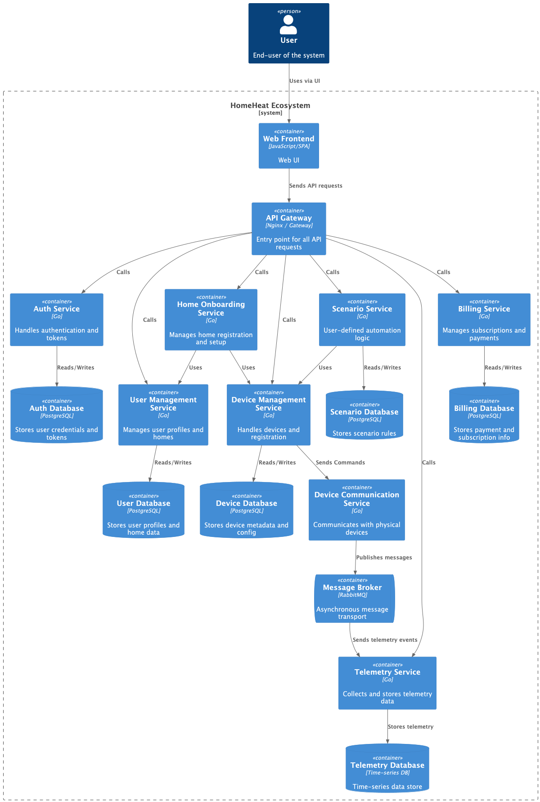

**Диаграмма компонентов (Components)**
### AuthService
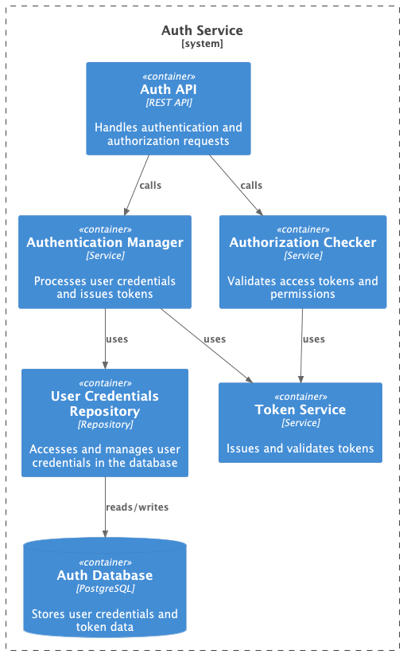
### UserManagementService
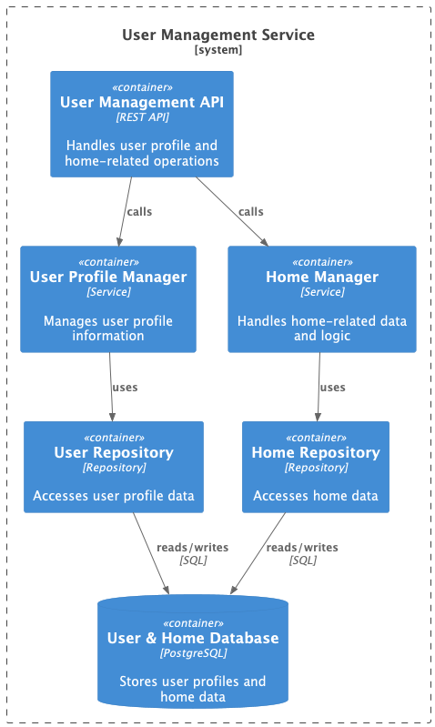
### DeviceManagementService
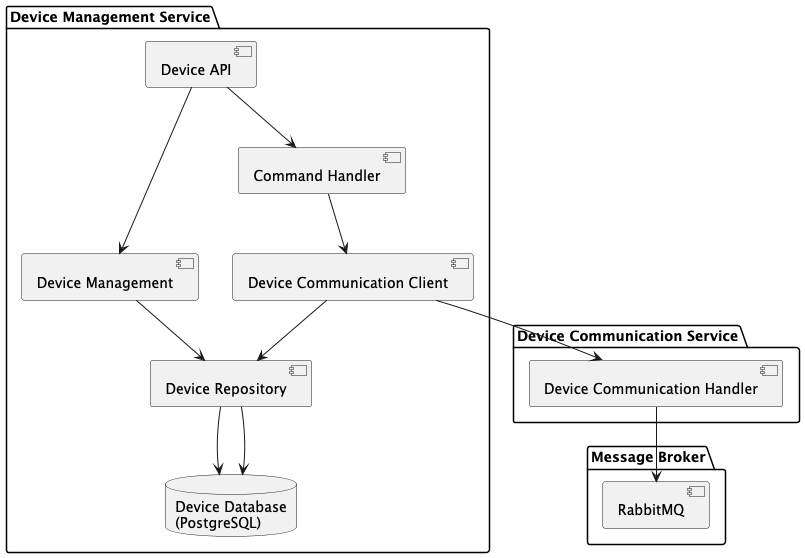
### ScenarioService
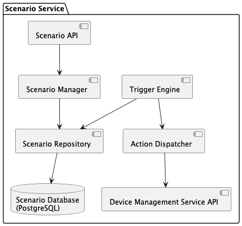
### TelemetryService
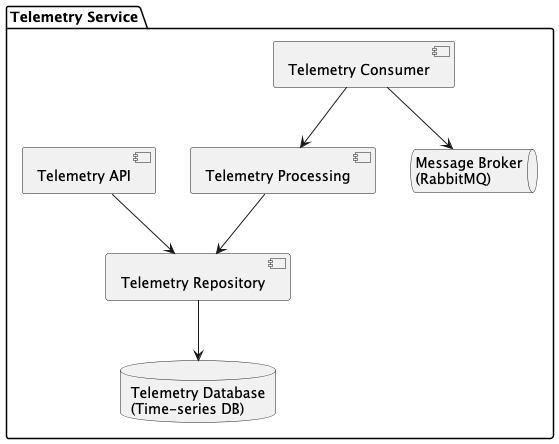
### HomeOnboardingService
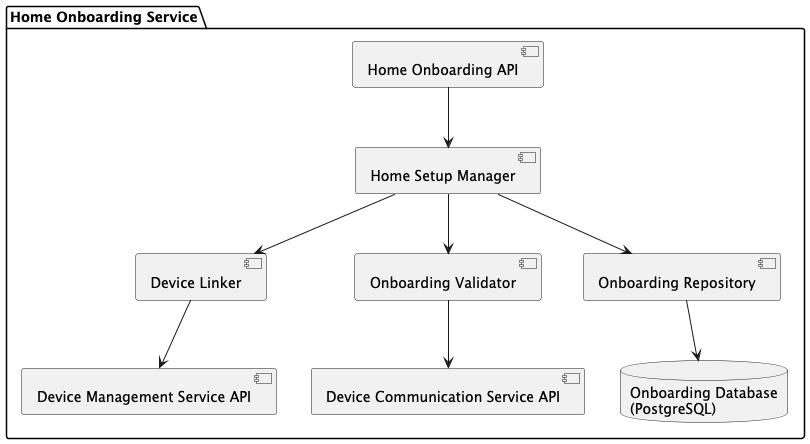
### BillingService
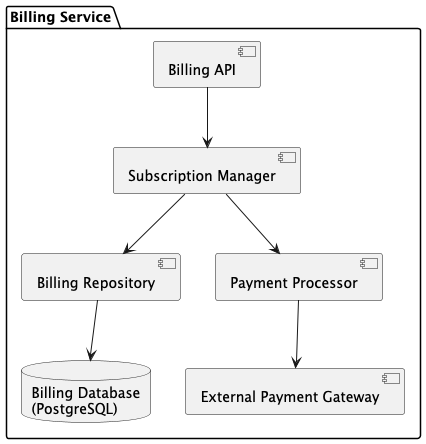

**Диаграмма кода (Code)**
### DeviceCommunicationService
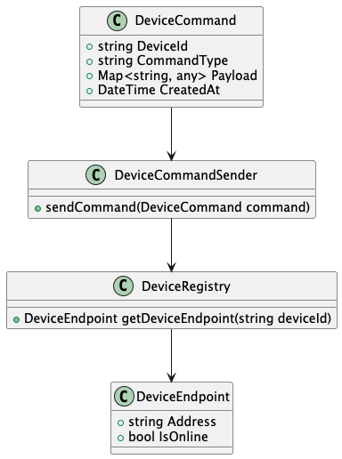
# Задание 3. Разработка ER-диаграммы
## 1. Идентификация сущностей
**User**\
**Home**\
**Device**\
**Subscription**\
**Payment**\
**Scenario**\
**TelemetryEvent**
## 2. Определение атрибутов
**User**\
_id_ - Уникальный идентификатор\
_email_ - Почта для логина\
_phone_ - Номер телефона\
_passwordHash_ - Хеш пароля\
_roles_ - Роли (например, пользователь, админ)\
_status_ - Активен / Заблокирован\
_createdAt_ - Дата создания\
_lastLoginAt_ - Последняя активность\
**Home**\
_id_ - Уникальный идентификатор\
_ownerId_ - ID владельца (Пользователь)\
_name_ - Название дома (например, "Дом на даче")\
_address_ - Физический адрес\
_location_ - Геолокация (широта/долгота)\
_connectionStatus_ - Статус подключения (Online/Offline)\
_createdAt_ - Дата добавления в систему\
**Device**\
_id_ - Уникальный идентификатор\
_homeId_ - ID Дома\
_type_ - Тип устройства (отопление, свет, ворота, камера)\
_model_ - Модель устройства\
_manufacturer_ - Производитель\
_status_ - Online/Offline/Ошибка\
_connectionInfo_ - Данные для подключения (HTTP, IP-адрес)\
_lastSeenAt_ - Последнее взаимодействие\
**Subscription**\
_id_ - Уникальный идентификатор\
_userId_ - Владелец подписки\
_plan_ - Название плана (Базовый, Премиум)\
_startDate_ - Дата начала подписки\
_endDate_ - Дата окончания подписки\
_status_ - Активна / Просрочена / Ожидает оплаты\
**Payment**\
_id_ - Уникальный идентификатор\
_userId_ - Плательщик\
_amount_ - Сумма\
_currency_ - Валюта\
_paymentMethod_ - Метод оплаты (карта, банковский перевод и т.п.)\
_status_ - Успешен / Обработка / Неудача\
_paidAt_ - Время оплаты\
**Scenario**\
_id_ - Уникальный идентификатор\
_homeId_ - К какому дому привязан\
_name_ - Название сценария\
_trigger_ - Условие срабатывания (например, "температура ниже 18°C")\
_actions_ - Список действий\
_status_ - Включён / Выключен\
_createdAt_ - Дата создания\
**TelemetryEvent**\
_id_ - Уникальный идентификатор\
_deviceId_ - Устройство, которое отправило данные\
_timestamp_ - Время события\
_type_ - Тип события (температура, влажность, движение)\
_payload_ - Данные события (например, "температура = 22°C")\
## 3. Описание связей
### 1. User <-> Home
Один пользователь может иметь несколько домов.
Один дом принадлежит одному пользователю.
### 2. Home <-> Device
Один дом может содержать несколько устройств.
Одно устройство принадлежит только одному дому.
### 3. User <-> Subscription
Один пользователь имеет одну активную подписку.
Одна подписка принадлежит только одному пользователю.
### 4. User <-> Payment
Один пользователь может совершить много платежей.
Один платеж принадлежит только одному пользователю.
### 5. Device <-> TelemetryEvent
Одно устройство генерирует много событий телеметрии.
Одно событие телеметрии принадлежит только одному устройству.
### 6. Home <-> Scenario
Один дом может иметь много сценариев.
Один сценарий принадлежит только одному дому. 
### 7. Scenario <-> Device
Один сценарий может управлять несколькими устройствами.
Одно устройство может участвовать в нескольких сценариях.
## 4. Построение ER-диаграммы
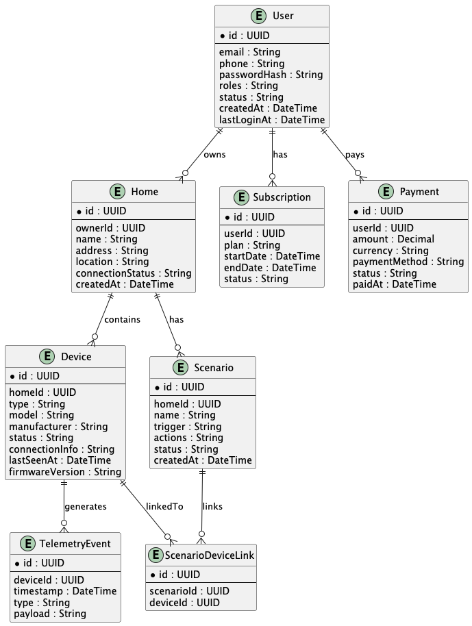

# Задание 4. Создание и документирование API
### 1. Тип API
REST API: AuthService, UserManagementService, DeviceManagementService, HomeOnboardingService, ScenarioService, BillingService, частично TelemetryService\
Async API: DeviceCommunicationService, TelemetryService

### 2. Документация API
[AuthService API](apps/smart_home/.docs/api_docs/authService.yaml)\
[UserManagementService API](apps/smart_home/.docs/api_docs/userManagementService.yaml)\
[DeviceManagementService API](apps/smart_home/.docs/api_docs/deviceManagementService.yaml)\
[ScenarioService API](apps/smart_home/.docs/api_docs/scenarioService.yaml)\
[DeviceCommunicationService API](apps/smart_home/.docs/api_docs/deviceCommunicationService.yaml)\
[TelemetryService API](apps/smart_home/.docs/api_docs/telemetryService.yaml)\
[HomeOnboardingService API](apps/smart_home/.docs/api_docs/homeOnboardingService.yaml)\
[BillingService API](apps/smart_home/.docs/api_docs/billingService.yaml)
